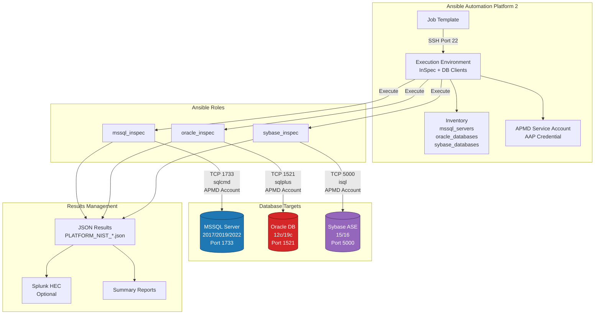
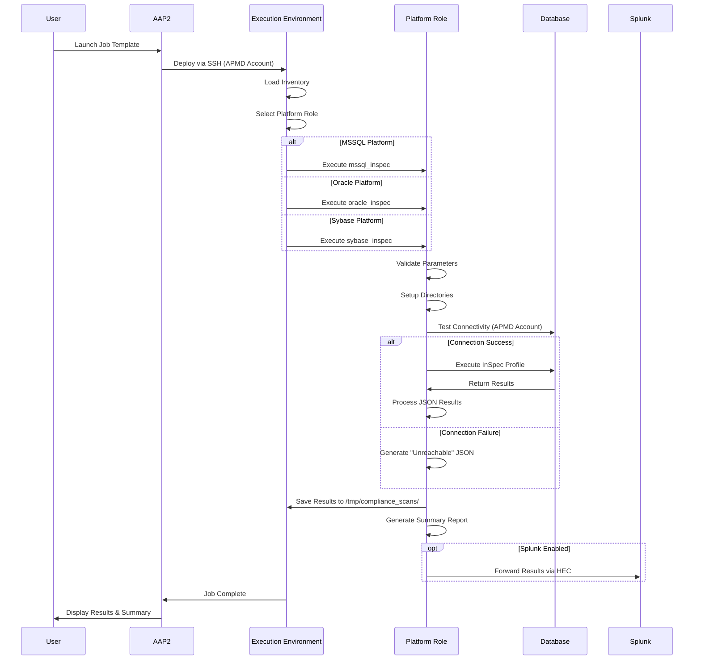

# Database Compliance Scanning Framework - Design Document

**Author:** Platform Engineering / DevOps
**Version:** 1.0
**Date:** 2025-10-14
**Tooling:** Ansible AAP2, InSpec, Splunk (optional)

---

## 1. Purpose

This document defines the design and architecture of the **Database Compliance Scanning Framework** using Ansible AAP2 and InSpec. The framework enables automated NIST compliance scanning across multiple database platforms — **MSSQL**, **Oracle**, and **Sybase** — using native credentials, standard Ansible roles, and repeatable playbooks executed from AAP2.

This solution refactors the original `NIST_for_db.ksh` bash script into a modern, scalable, and maintainable Ansible-based orchestration framework while maintaining full backward compatibility with existing file formats and workflows.

---

## 2. Architecture Overview

### 2.1 Logical Overview

Each compliance scan is orchestrated from **Ansible AAP2**, which triggers job templates that execute on delegate hosts (execution environments). These delegate hosts run InSpec scans using the appropriate platform-specific role (`mssql_inspec`, `oracle_inspec`, `sybase_inspec`), and results are exported as JSON for analysis or ingestion into Splunk.

The framework operates on an **inventory-based architecture** where:
- Each database (or database server for MSSQL) is represented as an inventory host
- A single APMD service account is used for AAP2 SSH connectivity and database access
- Platform-specific roles handle database-specific connectivity and scanning
- Results follow the original script naming conventions for compatibility

---

### 2.2 Architecture Diagram (Mermaid)



---

### 2.3 Architecture Diagram (ASCII)

```
+----------------------------------+
|  Ansible Automation Platform 2   |
|  - Job Templates                 |
|  - Execution Environment (EE)    |
|  - Inventory Management          |
|  - APMD Service Account          |
+-----------------+----------------+
                  | SSH Port 22
                  | (APMD Account)
                  v
+----------------------------------+
|      Delegate Host / EE          |
|  - InSpec Binary                 |
|  - sqlcmd (MSSQL)                |
|  - sqlplus (Oracle)              |
|  - isql (Sybase)                 |
|  - Role Execution                |
+--------+----------+--------+-----+
         |          |        |
   TCP 1733    TCP 1521  TCP 5000
   (APMD)      (APMD)    (APMD)
         |          |        |
         v          v        v
   +---------+ +---------+ +---------+
   |  MSSQL  | | Oracle  | | Sybase  |
   | Server  | |   DB    | |   ASE   |
   | 2017+   | | 12c/19c | |  15/16  |
   +---------+ +---------+ +---------+
         |          |        |
         +----------+--------+
                    |
                    v
         +---------------------+
         | Results Management  |
         | - JSON Files        |
         | - Summary Reports   |
         | - Splunk (Optional) |
         +---------------------+
                    |
              HTTPS 8088
                    v
         +---------------------+
         |  Splunk HEC         |
         |  (Optional)         |
         +---------------------+
```

---

### 2.4 Connectivity Matrix

| Component | Source | Destination | Protocol | Port | Description |
|-----------|--------|-------------|----------|------|-------------|
| AAP2 Controller | AAP2 | Delegate Host | SSH | 22 | Launches jobs to EE (APMD account) |
| Delegate Host | EE Runner | MSSQL Server | TCP | 1733 | SQL Server connectivity (APMD account) |
| Delegate Host | EE Runner | Oracle DB | TCP | 1521 | Oracle listener (APMD account) |
| Delegate Host | EE Runner | Sybase DB | TCP | 5000/1025 | Sybase ASE listener (APMD account) |
| Delegate Host | EE Runner | Splunk HEC | HTTPS | 8088 | Optional metrics/log ingestion |

---

## 3. Execution Flow

### 3.1 High-Level Workflow



### 3.2 Detailed Step-by-Step Flow

#### Step 1: Job Trigger
- AAP2 launches a job template using APMD service account credentials
- Execution environment (EE) deployed to delegate host containing:
  - InSpec binary
  - Database client tools (sqlcmd, sqlplus, isql)
  - Ansible roles and playbooks

#### Step 2: Inventory Selection
- Hosts are dynamically loaded from inventory files organized by platform:
  - `mssql_servers` - Server-level MSSQL hosts (scans all databases on server)
  - `oracle_databases` - Database-level Oracle hosts
  - `sybase_databases` - Database-level Sybase hosts
- APMD service account used for all database connections

#### Step 3: Role Execution
Platform-specific role is executed based on `database_platform` variable:

**For MSSQL (`mssql_inspec`):**
1. `validate.yml` - Validates MSSQL connection parameters
2. `setup.yml` - Creates result directories, discovers control files
3. `execute.yml` - Runs InSpec using sqlcmd backend
4. `process_results.yml` - Parses JSON results, applies file naming
5. `cleanup.yml` - Generates summary report, optional cleanup
6. `splunk_integration.yml` - Forwards to Splunk (if enabled)

**For Oracle (`oracle_inspec`):**
1. `validate.yml` - Validates Oracle connection (TNS/Service Name)
2. `setup.yml` - Creates result directories, discovers control files
3. `execute.yml` - Runs InSpec using sqlplus backend
4. `process_results.yml` - Parses JSON results
5. `cleanup.yml` - Generates summary report
6. `splunk_integration.yml` - Forwards to Splunk (if enabled)

**For Sybase (`sybase_inspec`):**
1. `validate.yml` - Validates Sybase connection parameters
2. `setup.yml` - Creates result directories, discovers control files
3. `execute.yml` - Runs InSpec using isql backend
4. `process_results.yml` - Parses JSON results
5. `cleanup.yml` - Generates summary report
6. `splunk_integration.yml` - Forwards to Splunk (if enabled)

#### Step 4: InSpec Scan Execution
- InSpec runs using native database clients with APMD service account
- Control files loaded from version-specific directories:
  - MSSQL: `mssql_inspec/files/MSSQL{VERSION}_ruby/*.rb`
  - Oracle: `oracle_inspec/files/ORACLE{VERSION}_ruby/*.rb`
  - Sybase: `sybase_inspec/files/SYBASE{VERSION}_ruby/*.rb`
- Results saved in JSON format with original script naming convention:
  - `{PLATFORM}_NIST_{PID}_{SERVER}_{DB}_{VERSION}_{TIMESTAMP}_{CONTROL}.json`

#### Step 5: Result Processing & Reporting
- JSON results parsed for compliance status
- Summary reports generated with:
  - Total controls executed
  - Pass/Fail counts
  - Compliance percentage
  - Failed control details
- Results exported to: `/tmp/compliance_scans/{PLATFORM}/{HOST}/{TIMESTAMP}/`
- Optional forwarding to Splunk HEC endpoint

---

## 4. Role and File Structure

### 4.1 Repository Structure

```
aks-gitops/
├── mssql_inspec/                    # MSSQL InSpec role
│   ├── tasks/
│   │   ├── main.yml                 # Main orchestration
│   │   ├── validate.yml             # Parameter validation
│   │   ├── setup.yml                # Directory and control file setup
│   │   ├── execute.yml              # InSpec execution
│   │   ├── process_results.yml      # Result processing
│   │   ├── cleanup.yml              # Cleanup and reporting
│   │   └── splunk_integration.yml   # Splunk forwarding
│   ├── defaults/main.yml            # Default variables
│   ├── vars/main.yml                # Role variables
│   ├── templates/
│   │   └── summary_report.j2        # Report template
│   ├── files/                       # InSpec control files
│   │   ├── MSSQL2008_ruby/
│   │   ├── MSSQL2012_ruby/
│   │   ├── MSSQL2014_ruby/
│   │   ├── MSSQL2016_ruby/
│   │   ├── MSSQL2017_ruby/
│   │   ├── MSSQL2018_ruby/
│   │   └── MSSQL2019_ruby/
│   │       └── trusted.rb           # Sample InSpec control
│   └── README.md
│
├── oracle_inspec/                   # Oracle InSpec role
│   ├── tasks/
│   │   ├── main.yml
│   │   ├── validate.yml
│   │   ├── setup.yml
│   │   ├── execute.yml
│   │   ├── process_results.yml
│   │   ├── cleanup.yml
│   │   └── splunk_integration.yml
│   ├── defaults/main.yml
│   ├── vars/main.yml
│   ├── templates/
│   │   └── oracle_summary_report.j2
│   ├── files/
│   │   ├── ORACLE11g_ruby/
│   │   ├── ORACLE12c_ruby/
│   │   ├── ORACLE18c_ruby/
│   │   └── ORACLE19c_ruby/
│   │       └── trusted.rb
│   └── README.md
│
├── sybase_inspec/                   # Sybase InSpec role
│   ├── tasks/
│   │   ├── main.yml
│   │   ├── validate.yml
│   │   ├── setup.yml
│   │   ├── execute.yml
│   │   ├── process_results.yml
│   │   ├── cleanup.yml
│   │   └── splunk_integration.yml
│   ├── defaults/main.yml
│   ├── vars/main.yml
│   ├── templates/
│   │   └── sybase_summary_report.j2
│   ├── files/
│   │   ├── SYBASE15_ruby/
│   │   └── SYBASE16_ruby/
│   └── README.md
│
├── inventory_converter/             # Flat file converter
│   ├── convert_flatfile_to_inventory.yml
│   ├── process_flatfile_line.yml
│   ├── templates/
│   │   └── vault_template.j2
│   └── README.md
│
├── playbooks/
│   ├── run_mssql_inspec.yml         # MSSQL scanning playbook
│   ├── run_oracle_inspec.yml        # Oracle scanning playbook
│   ├── run_sybase_inspec.yml        # Sybase scanning playbook
│   └── run_compliance_scans.yml     # Multi-platform playbook
│
└── group_vars/
    └── all/
        └── vars.yml                 # Non-sensitive variables
```

### 4.2 Inventory Structure

**MSSQL Inventory (Server-Level):**
```yaml
all:
  children:
    mssql_servers:
      hosts:
        server01_1733:
          database_platform: mssql
          mssql_server: server01
          mssql_port: 1733
          mssql_version: "2019"
          # Note: APMD service account used for connection
          # InSpec scans ALL databases on this server
```

**Oracle/Sybase Inventory (Database-Level):**
```yaml
all:
  children:
    oracle_databases:
      hosts:
        oracleserver01_orcl_1521:
          database_platform: oracle
          oracle_server: oracleserver01
          oracle_database: orcl
          oracle_service: XE
          oracle_port: 1521
          oracle_version: "19c"
          # Note: APMD service account used for connection

    sybase_databases:
      hosts:
        sybaseserver01_master_5000:
          database_platform: sybase
          sybase_server: sybaseserver01
          sybase_database: master
          sybase_service: SAP_ASE
          sybase_port: 5000
          sybase_version: "16"
          # Note: APMD service account used for connection
```

---

## 5. Security

### 5.1 APMD Service Account

**Single Service Account Model:**
- **APMD service account** is used for all operations:
  - AAP2 SSH connectivity to delegate hosts
  - MSSQL database scanning with RBAC permissions
  - Oracle database scanning with granted permissions
  - Sybase database scanning with granted permissions

**Authentication Flow:**
1. AAP2 uses APMD service account credential to SSH to delegate host
2. Delegate host uses same APMD account to connect to databases
3. Database teams grant APMD account necessary read-only permissions
4. All scan operations execute under APMD account context

### 5.2 Security Best Practices

**Access Control:**
- APMD service account configured as AAP2 Machine Credential
- APMD account granted RBAC permissions on MSSQL servers for scan execution
- APMD account granted necessary permissions on Oracle and Sybase databases
- Read-only access enforced at database level
- Principle of Least Privilege applied

**Monitoring & Compliance:**
- All scan activities logged in AAP2 job output
- Database connection attempts logged in DB audit logs
- APMD account activity monitored for anomalies
- Regular access reviews for APMD account permissions

---

## 6. Error Handling

### 6.1 Error Detection & Recovery

| Failure Type | Detection Method | Recovery Action | Result |
|--------------|------------------|-----------------|---------|
| **SSH Connection Failure** | AAP2 cannot SSH to delegate host | Retry 2x, alert on failure | Job fails with connection error |
| **Database Connection Failure** | SQL client exit code != 0 | Retry 2x with 30s delay | Generate "Unreachable" JSON if all retries fail |
| **InSpec Execution Failure** | InSpec returns non-zero exit code | Log stderr, continue | Generate error JSON with details |
| **JSON Parse Failure** | Invalid JSON in InSpec output | Move to `/tmp/failed_results/` | Log parse error, skip result processing |
| **Missing Control File** | Control file not found in role files | Fail task with descriptive message | Abort scan for that database |
| **Network Timeout** | Connection timeout to database | Retry with exponential backoff | Generate "Unreachable" after max retries |
| **Splunk Forwarding Failure** | HEC endpoint unreachable | Log warning, continue | Results saved locally, Splunk optional |

### 6.2 Error JSON Format (Original Script Compatibility)

**Connection Failure JSON:**
```json
{
  "platform": "MSSQL",
  "version": "1",
  "profiles": [
    {
      "name": "MSSQL Compliance",
      "version": "1.0.0",
      "status": "Unreachable",
      "controls": [
        {
          "id": "connection-test",
          "title": "Database Connection Test",
          "status": "failed",
          "code_desc": "Connection to server01:1733 failed",
          "results": [
            {
              "status": "failed",
              "code_desc": "Connection failed",
              "run_time": 0.0,
              "start_time": "2025-10-14T12:00:00Z"
            }
          ]
        }
      ],
      "statistics": {
        "duration": 0.0
      }
    }
  ],
  "statistics": {
    "duration": 0.0
  }
}
```

### 6.3 Retry Logic

**Connection Retry Configuration:**
```yaml
# In role defaults/main.yml
max_connection_retries: 2
retry_delay: 30  # seconds
connection_timeout: 60  # seconds
inspec_timeout: 1800  # 30 minutes per control
```

---

## 7. Result Management

### 7.1 Result File Structure

**Base Directory:**
```
/tmp/compliance_scans/
├── mssql/
│   └── server01_1733_1728912345/
│       ├── MSSQL_NIST_12345_server01_db01_2019_1728912345_trusted.json
│       ├── MSSQL_NIST_12345_server01_db01_2019_1728912345_audit.json
│       └── summary_report.txt
├── oracle/
│   └── oracleserver01_orcl_1728912456/
│       ├── ORACLE_NIST_12346_oracleserver01_orcl_19c_1728912456_trusted.json
│       └── summary_report.txt
└── sybase/
    └── sybaseserver01_master_1728912567/
        ├── SYBASE_NIST_12347_sybaseserver01_master_16_1728912567_trusted.json
        └── summary_report.txt
```

**File Naming Convention (Original Script Compatibility):**
```
{PLATFORM}_NIST_{PID}_{SERVER}_{DATABASE}_{VERSION}_{TIMESTAMP}_{CONTROL}.json

Where:
- PLATFORM: MSSQL, ORACLE, SYBASE
- PID: Ansible process ID (ansible_pid variable)
- SERVER: Database server hostname
- DATABASE: Database name
- VERSION: Database version (2019, 19c, 16, etc.)
- TIMESTAMP: Unix epoch timestamp
- CONTROL: Control file basename (trusted, audit, etc.)
```

**Examples:**
```
MSSQL_NIST_98765_sqlserver01_master_2019_1728912345_trusted.json
ORACLE_NIST_98766_oracleserver01_orcl_19c_1728912456_trusted.json
SYBASE_NIST_98767_sybaseserver01_master_16_1728912567_trusted.json
```

### 7.2 Summary Report Format (Text)

```
=====================================
Database Compliance Scan Summary
=====================================
Platform: MSSQL
Server: sqlserver01:1733
Database: master
Version: 2019
Scan Date: 2025-10-14 12:00:00
Scan Duration: 45.67 seconds

Control Results:
================
Total Controls: 150
Passed: 142 (94.67%)
Failed: 5 (3.33%)
Skipped: 3 (2.00%)

Failed Controls:
================
1. [MSSQL-2019-042] Ensure 'sa' account is disabled
   Status: FAILED
   Description: The 'sa' account is enabled

2. [MSSQL-2019-078] Ensure 'Remote Access' is disabled
   Status: FAILED
   Description: Remote access is enabled

... [truncated]

Compliance Score: 94.67%
Overall Status: PASSED (threshold: 90%)

Results Location: /tmp/compliance_scans/mssql/sqlserver01_1733_1728912345/
=====================================
```

### 7.3 Splunk Integration (Optional)

**HEC Event Format:**
```json
{
  "time": 1728912345,
  "index": "compliance_scans",
  "source": "ansible_database_compliance",
  "sourcetype": "ansible:database:compliance",
  "event": {
    "job_id": "AAP2-12345",
    "project": "database_compliance",
    "platform": "MSSQL",
    "server": "sqlserver01",
    "port": 1733,
    "database": "master",
    "version": "2019",
    "scan_timestamp": 1728912345,
    "controls_total": 150,
    "controls_passed": 142,
    "controls_failed": 5,
    "controls_skipped": 3,
    "compliance_score": 94.67,
    "scan_duration": 45.67,
    "status": "completed",
    "result_file": "/tmp/compliance_scans/mssql/sqlserver01_1733_1728912345/MSSQL_NIST_98765_sqlserver01_master_2019_1728912345_trusted.json"
  }
}
```

---

## 8. Governance and Documentation

### 8.1 Document Storage

**Confluence:**
- **Location**: Platform Engineering → Database Compliance Framework
- **Documents**:
  - This Design Document
  - Inventory Conversion Guide
  - DB Team Integration Guide
  - Local Testing Guide
  - Troubleshooting Guide

**Git Repository:**
- **URL**: https://github.com/yourorg/aks-gitops
- **Branch Strategy**:
  - `main` - Production-ready code
  - `develop` - Development branch
  - `feature/*` - Feature branches

### 8.2 Linked Jira Stories

| Epic | Story ID | Title | Status |
|------|----------|-------|--------|
| NIST-100 | NIST-101 | EE Client Installation (InSpec + DB Clients) | Done |
| NIST-100 | NIST-102 | APMD Service Account Setup & Permissions | Done |
| NIST-100 | NIST-103 | MSSQL Scanning Role Development | Done |
| NIST-100 | NIST-104 | Oracle Scanning Role Development | Done |
| NIST-100 | NIST-105 | Sybase Scanning Role Development | Done |
| NIST-100 | NIST-106 | Sample DB Validation & Testing | Done |
| NIST-100 | NIST-107 | Connectivity Test Automation | Done |
| NIST-100 | NIST-108 | Flat File to Inventory Converter | Done |
| NIST-100 | NIST-109 | Multi-Platform Playbook Integration | Done |
| NIST-100 | NIST-110 | Splunk HEC Integration | In Progress |
| NIST-100 | NIST-111 | AAP2 Job Template Configuration | To Do |
| NIST-100 | NIST-112 | Production Deployment & Validation | To Do |

### 8.3 Runbooks and Procedures

**Operational Runbooks:**
1. **Database Onboarding Runbook** - Adding new databases to inventory
2. **APMD Account Management** - Managing service account permissions
3. **Troubleshooting Runbook** - Common issues and resolution
4. **Emergency Response Runbook** - Handling scan failures in production
5. **AAP2 Job Template Configuration** - Setting up new job templates

**Change Management:**
- All changes to production roles require peer review
- Job templates versioned in AAP2
- Inventory changes tracked in git
- APMD account permissions reviewed quarterly

---

## 9. Future Enhancements

### 9.1 Scalability Roadmap

**Current Capacity:**
- 500 databases per scan job
- 5 concurrent scans per delegate host
- 30-minute timeout per database scan

**Target Capacity (12 months):**
- 2,000 databases per scan job
- 20 concurrent scans per delegate host
- Distributed scanning across multiple AAP2 clusters
- Real-time scan progress tracking

---

## 10. Appendix

### 10.1 Glossary

| Term | Definition |
|------|------------|
| **AAP2** | Ansible Automation Platform 2 - Red Hat's enterprise automation platform |
| **APMD** | Application Management and Delivery - Service account used for scanning |
| **InSpec** | Chef InSpec - Compliance-as-code framework for infrastructure testing |
| **EE** | Execution Environment - Container image with Ansible runtime and dependencies |
| **HEC** | HTTP Event Collector - Splunk's HTTP endpoint for data ingestion |
| **NIST** | National Institute of Standards and Technology - US standards body |
| **Control** | InSpec control - A testable security/compliance requirement |
| **Profile** | InSpec profile - Collection of controls for a specific compliance framework |

### 10.2 References

- [Ansible AAP2 Documentation](https://docs.ansible.com/automation-controller/latest/)
- [InSpec Documentation](https://docs.chef.io/inspec/)
- [NIST SP 800-53 Security Controls](https://csrc.nist.gov/publications/detail/sp/800-53/rev-5/final)
- [Splunk HEC Documentation](https://docs.splunk.com/Documentation/Splunk/latest/Data/UsetheHTTPEventCollector)
- [Original NIST_for_db.ksh Script](./NIST_for_db.ksh)

### 10.3 Contact Information

| Role | Team | Contact |
|------|------|---------|
| **Platform Owner** | Platform Engineering | platform-team@example.com |
| **DevOps Lead** | DevOps Engineering | devops-lead@example.com |
| **Security Lead** | InfoSec | infosec-team@example.com |
| **Database Team** | Database Administration | dba-team@example.com |

---

**Document Version History:**

| Version | Date | Author | Changes |
|---------|------|--------|---------|
| 1.0 | 2025-10-14 | Platform Engineering | Initial comprehensive design document |

---

**End of Design Document**
