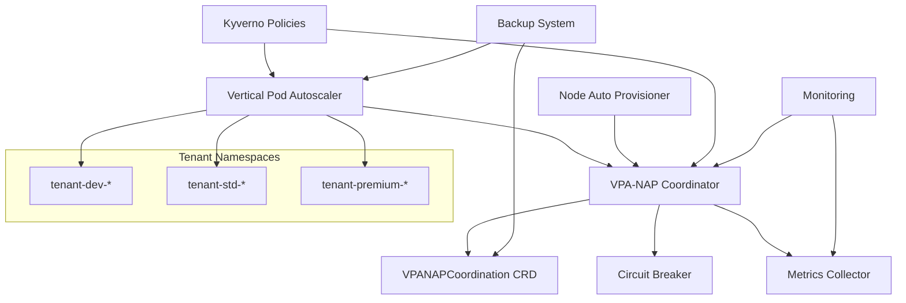

# VPA-NAP Integration Technical Specifications

## Table of Contents
1. [Architecture Overview](#architecture-overview)
2. [API Specifications](#api-specifications)
3. [Resource Requirements](#resource-requirements)
4. [Configuration Parameters](#configuration-parameters)
5. [Performance Specifications](#performance-specifications)
6. [Security Specifications](#security-specifications)
7. [Monitoring and Metrics](#monitoring-and-metrics)
8. [Deployment Specifications](#deployment-specifications)

---

## Architecture Overview

### Component Architecture



### Control Flow

1. **VPA Request Processing**
   - Kyverno validates VPA configuration
   - Coordinator evaluates conflict risk
   - Circuit breaker checks cluster stability
   - VPA processes workload recommendations

2. **Conflict Detection**
   - Monitor VPA eviction events
   - Monitor NAP scaling events
   - Detect temporal correlation
   - Trigger mitigation if needed

3. **Circuit Breaker Logic**
   ```
   IF (node_changes_5min > threshold) OR 
      (evictions_10min > threshold) OR
      (resource_oscillation > threshold)
   THEN
      trigger_circuit_breaker()
      disable_vpa_updates()
      enter_cooldown_period()
   ```

---

## API Specifications

### VPANAPCoordination Custom Resource

```yaml
apiVersion: platform.io/v1
kind: VPANAPCoordination
metadata:
  name: example-vpa
  namespace: tenant-std-app1
spec:
  # VPA target reference
  vpaName: "example-vpa"
  namespace: "tenant-std-app1"
  
  # Coordination strategy
  coordinationStrategy: "coordinated"  # isolated | coordinated | disabled
  enabled: true
  
  # Conflict prevention settings
  conflictPrevention:
    maxResourceChangePercent: 50
    cooldownPeriodMinutes: 30
    maxConflictsPerHour: 3
  
  # Circuit breaker configuration
  circuitBreaker:
    enabled: true
    nodeChurnThreshold: 5
    evictionThreshold: 20
    oscillationThreshold: 30
    cooldownMinutes: 30

status:
  # Current coordination state
  phase: "Active"  # Active | CircuitBreaker | Cooldown | Error
  lastUpdate: "2024-01-01T12:00:00Z"
  
  # Conflict tracking
  conflictsDetected: 0
  lastConflictTime: "2024-01-01T11:30:00Z"
  
  # Event history
  napEvents:
  - timestamp: "2024-01-01T12:00:00Z"
    event: "NodeScaleUp"
    nodeCount: 5
  
  vpaEvents:
  - timestamp: "2024-01-01T12:01:00Z"
    event: "RecommendationUpdate" 
    recommendation:
      cpu: "500m"
      memory: "1Gi"
  
  # Circuit breaker state
  circuitBreakerTriggered: false
  cooldownUntil: null
```

### Coordinator REST API

The coordinator exposes the following HTTP endpoints:

#### Health Endpoints
```
GET /healthz
Response: 200 OK "healthy"

GET /ready
Response: 200 OK "ready"
```

#### Coordination Endpoints
```
GET /api/v1/coordination/{namespace}/{vpa-name}
Response: VPANAPCoordination resource

POST /api/v1/coordination/{namespace}/{vpa-name}/circuit-breaker
Body: {"action": "trigger" | "reset", "reason": "string"}
Response: 200 OK

GET /api/v1/conflicts
Response: List of recent conflicts across all VPAs
```

#### Metrics Endpoint
```
GET /metrics
Response: Prometheus metrics format
```

---

## Resource Requirements

### Coordinator Component

| Component | CPU Request | CPU Limit | Memory Request | Memory Limit | Replicas |
|-----------|-------------|-----------|----------------|-------------|----------|
| Coordinator | 100m | 500m | 128Mi | 256Mi | 3 (HA) |
| Backup Jobs | 100-200m | 500m-1 | 128-256Mi | 256-512Mi | 1 |
| Test Jobs | 100-500m | 1-2 | 128-512Mi | 256Mi-1Gi | 1 |

### Storage Requirements

| Component | Storage Type | Size | IOPS | Retention |
|-----------|-------------|------|------|-----------|
| VPA Checkpoints | Fast SSD | 1-10Gi per 1000 VPAs | 1000+ | 7 days |
| Backup Storage | Standard | 10-100Gi per 1000 VPAs | 100+ | 30 days |
| Metrics Storage | Fast SSD | 5-50Gi per month | 500+ | 90 days |

### Network Requirements

| Component | Ingress | Egress | Latency | Bandwidth |
|-----------|---------|--------|---------|-----------|
| Coordinator | 10-100 req/s | 10-100 req/s | <100ms | 1-10Mbps |
| Backup | Minimal | 1-10Mbps | <1s | 10-100Mbps |
| Monitoring | 100-1000 req/s | Minimal | <50ms | 1-5Mbps |

---

## Configuration Parameters

### Global Configuration

```yaml
# coordinator-config.yaml
coordinatorConfig:
  # Circuit breaker thresholds
  circuitBreaker:
    nodeChurnThreshold: 5           # Max node changes in 5 minutes
    evictionThreshold: 20           # Max evictions in 10 minutes
    resourceOscillationPercent: 30  # Max resource change oscillation
    cooldownMinutes: 30             # Circuit breaker cooldown period
    
  # Coordination delays
  delays:
    vpaUpdateDelay: "5m"           # Wait after NAP action before VPA update
    napActionDelay: "10m"          # Wait after VPA update before NAP action
    
  # Rate limiting
  rateLimiting:
    maxVPAUpdatesPerHour: 60       # Global limit
    maxVPAUpdatesPerNamespace: 10   # Per namespace limit
    
  # Monitoring
  monitoring:
    metricsInterval: "30s"
    healthCheckInterval: "10s"
    conflictCheckInterval: "60s"
```

### Tenant-Specific Configuration

```yaml
# tenant-tier-config.yaml
tenantTiers:
  dev:
    vpa:
      updateMode: "Auto"
      maxResourceChange: 200%
      cooldownMinutes: 15
    resources:
      maxCPU: "2"
      maxMemory: "4Gi"
    monitoring:
      alertSeverity: "info"
      
  standard:
    vpa:
      updateMode: "Initial" 
      maxResourceChange: 50%
      cooldownMinutes: 30
    resources:
      maxCPU: "8"
      maxMemory: "16Gi"
    monitoring:
      alertSeverity: "warning"
      
  premium:
    vpa:
      updateMode: "Off"
      maxResourceChange: 0%
      cooldownMinutes: 60
    resources:
      maxCPU: "32"
      maxMemory: "64Gi"
    monitoring:
      alertSeverity: "critical"
```

### Kyverno Policy Configuration

```yaml
# kyverno-config.yaml
policyConfig:
  validation:
    enforceMode: true               # Enforce vs warn
    backgroundScan: false           # Don't scan existing resources
    failurePolicy: "Fail"          # Fail requests on policy errors
    
  mutation:
    enableAutoLabeling: true        # Auto-add coordination labels
    enableTierDefaults: true        # Apply tier-based defaults
    
  generation:
    enableAutoResources: true       # Auto-generate support resources
    enableMonitoring: true          # Auto-generate monitoring configs
```

---

## Performance Specifications

### Response Time Requirements

| Operation | Target Response Time | Maximum Acceptable |
|-----------|---------------------|-------------------|
| VPA Validation | <100ms | <500ms |
| Circuit Breaker Check | <50ms | <200ms |
| Coordination Decision | <200ms | <1s |
| Backup Creation | <5min | <15min |
| Restore Operation | <10min | <30min |

### Throughput Requirements

| Metric | Target | Peak Capacity |
|--------|--------|---------------|
| VPA Operations/sec | 10-100 | 500 |
| Concurrent VPAs | 1,000 | 10,000 |
| Coordination Checks/min | 100 | 1,000 |
| Policy Evaluations/sec | 50 | 500 |

### Scalability Specifications

| Component | Linear Scale Factor | Maximum Scale |
|-----------|-------------------|---------------|
| VPAs per Namespace | 1:50 workloads | 200 VPAs |
| Namespaces per Cluster | 1:10 tenants | 1,000 namespaces |
| Coordinator Instances | 1:1,000 VPAs | 10 instances |
| Policy Evaluations | O(n) with VPA count | 100,000/hour |

### Resource Usage Baselines

```yaml
# performance-baselines.yaml
baselines:
  coordinator:
    cpu:
      idle: "20-50m"
      normal: "100-200m"  
      peak: "300-500m"
    memory:
      idle: "64-128Mi"
      normal: "128-256Mi"
      peak: "256-512Mi"
    
  vpa:
    overhead_per_vpa:
      cpu: "1-5m"
      memory: "1-5Mi"
      storage: "1-10Mi"
    
  cluster_impact:
    api_server_qps: "1-10 per VPA"
    etcd_objects: "3-5 per VPA"
    network_bandwidth: "1-100KB/s per VPA"
```

---

## Security Specifications

### RBAC Requirements

```yaml
# rbac-specifications.yaml
rbacModel:
  # Coordinator service account
  coordinator:
    clusterRole: "vpa-nap-coordinator"
    permissions:
      - apiGroups: ["autoscaling.k8s.io"]
        resources: ["verticalpodautoscalers"]
        verbs: ["get", "list", "watch", "patch"]
      - apiGroups: ["platform.io"]
        resources: ["vpanapcoordinations"]
        verbs: ["get", "list", "watch", "create", "update", "patch", "delete"]
    
  # Backup service account  
  backup:
    clusterRole: "vpa-backup-operator"
    permissions:
      - apiGroups: ["autoscaling.k8s.io"]
        resources: ["*"]
        verbs: ["*"]
      - apiGroups: [""]
        resources: ["configmaps", "secrets"]
        verbs: ["*"]
```

### Network Security

```yaml
# network-security-specs.yaml
networkPolicies:
  coordinator:
    ingress:
      - from: [{namespaceSelector: {matchLabels: {name: "monitoring"}}}]
        ports: [{protocol: "TCP", port: 8080}]
    egress:
      - to: [{namespaceSelector: {}}]  # Kubernetes API
        ports: [{protocol: "TCP", port: 443}]
      - to: [{namespaceSelector: {matchLabels: {name: "kube-system"}}}]  # DNS
        ports: [{protocol: "UDP", port: 53}]
```

### Pod Security Standards

```yaml
# pod-security-specs.yaml
podSecurity:
  level: "restricted"
  requirements:
    runAsNonRoot: true
    runAsUser: 65534
    readOnlyRootFilesystem: true
    allowPrivilegeEscalation: false
    capabilities:
      drop: ["ALL"]
    seccompProfile:
      type: "RuntimeDefault"
```

---

## Monitoring and Metrics

### Key Metrics

```yaml
# metrics-specifications.yaml
metrics:
  # Coordinator metrics
  coordinator:
    - name: "vpa_nap_coordinator_healthy"
      type: "gauge"
      description: "Coordinator health status"
      
    - name: "vpa_nap_conflicts_total"
      type: "counter"
      description: "Total number of VPA-NAP conflicts detected"
      labels: ["namespace", "vpa_name", "conflict_type"]
      
    - name: "vpa_nap_circuit_breaker_triggered_total"
      type: "counter"
      description: "Circuit breaker trigger count"
      labels: ["namespace", "reason"]
      
    - name: "vpa_nap_coordination_duration_seconds"
      type: "histogram"
      description: "Time taken for coordination decisions"
      labels: ["operation"]
      
  # VPA metrics
  vpa:
    - name: "vpa_recommendations_total"
      type: "counter"
      description: "VPA recommendation updates"
      labels: ["namespace", "vpa_name", "container"]
      
    - name: "vpa_recommendation_drift_percent"
      type: "gauge"
      description: "Drift between recommendations and actual usage"
      labels: ["namespace", "vpa_name", "resource"]
```

### Alerting Rules

```yaml
# alerting-rules.yaml
groups:
- name: vpa-nap-critical
  rules:
  - alert: VPANAPCoordinatorDown
    expr: up{job="vpa-nap-coordinator"} == 0
    for: 1m
    labels:
      severity: critical
    annotations:
      summary: "VPA-NAP coordinator is down"
      
  - alert: VPANAPConflictStorm
    expr: rate(vpa_nap_conflicts_total[5m]) > 0.5
    for: 5m
    labels:
      severity: critical
    annotations:
      summary: "High rate of VPA-NAP conflicts detected"
      
  - alert: VPANAPCircuitBreakerActive
    expr: vpa_nap_circuit_breaker_active > 0
    for: 1m
    labels:
      severity: warning
    annotations:
      summary: "VPA-NAP circuit breaker is active"
```

### Dashboard Specifications

```yaml
# dashboard-specs.yaml
dashboards:
  overview:
    title: "VPA-NAP Integration Overview"
    panels:
      - title: "Active VPAs by Tier"
        type: "stat"
        query: "count by (tenant_tier) (vpa_active)"
        
      - title: "Conflict Rate"
        type: "graph"
        query: "rate(vpa_nap_conflicts_total[5m])"
        
      - title: "Circuit Breaker Status"
        type: "table"
        query: "vpa_nap_circuit_breaker_status"
        
  performance:
    title: "VPA-NAP Performance Metrics"
    panels:
      - title: "Coordination Latency"
        type: "heatmap"
        query: "vpa_nap_coordination_duration_seconds"
        
      - title: "Resource Usage"
        type: "graph"
        queries:
          - "container_cpu_usage_seconds_total{pod=~'vpa-nap-coordinator.*'}"
          - "container_memory_usage_bytes{pod=~'vpa-nap-coordinator.*'}"
```

---

## Deployment Specifications

### Prerequisites

```yaml
# deployment-prerequisites.yaml
prerequisites:
  kubernetes:
    version: ">=1.23.0"
    features:
      - "CustomResourceDefinition"
      - "AdmissionWebhooks"
      - "PodSecurityPolicy" # or Pod Security Standards
      
  dependencies:
    required:
      - name: "vertical-pod-autoscaler"
        version: ">=0.11.0"
      - name: "kyverno"
        version: ">=1.8.0"
      - name: "prometheus-operator"  # Optional but recommended
        version: ">=0.60.0"
        
    optional:
      - name: "cert-manager"
        version: ">=1.8.0"
        purpose: "TLS certificate management"
      - name: "external-secrets-operator"
        version: ">=0.6.0"
        purpose: "External secret management"
```

### Installation Steps

```yaml
# installation-steps.yaml
installation:
  steps:
    1:
      name: "Install Prerequisites"
      commands:
        - "kubectl apply -f https://github.com/kubernetes/autoscaler/releases/download/vertical-pod-autoscaler-0.11.0/vpa-v0.11.0.yaml"
        - "helm install kyverno kyverno/kyverno --version 2.6.0"
        
    2:
      name: "Install Custom Resources"
      commands:
        - "kubectl apply -f vpa-nap-coordinator-alternative.yaml"
        
    3:
      name: "Install Policies"
      commands:
        - "kubectl apply -f kyverno-*.yaml"
        
    4:
      name: "Install Coordinator"
      commands:
        - "kubectl apply -f high-availability.yaml"
        - "kubectl apply -f security-hardening.yaml"
        
    5:
      name: "Configure Monitoring"
      commands:
        - "kubectl apply -f monitoring-*.yaml"
        
    6:
      name: "Setup Backup"
      commands:
        - "kubectl apply -f backup-recovery.yaml"
        
  validation:
    commands:
      - "kubectl get pods -n platform -l app=vpa-nap-coordinator"
      - "kubectl get vpanapcoordinations --all-namespaces"
      - "kubectl get clusterpolicies"
```

### Upgrade Path

```yaml
# upgrade-specifications.yaml
upgrades:
  compatibility:
    v1_to_v2:
      breaking_changes:
        - "VPANAPCoordination CRD schema v1 -> v2"
        - "Coordinator API endpoints restructured"
      migration_steps:
        1: "Backup existing configurations"
        2: "Apply new CRD version"
        3: "Migrate coordination resources"
        4: "Update coordinator deployment"
        5: "Validate functionality"
        
  rollback:
    supported_versions: 2  # Can rollback 2 versions
    automatic: false       # Manual rollback only
    validation_required: true
```

---

## Validation and Testing

### Functional Tests

```yaml
# functional-test-specs.yaml
functionalTests:
  unit:
    coverage_target: 85%
    frameworks: ["bash", "kubectl"]
    execution_time: "<5min"
    
  integration:
    scenarios:
      - "VPA creation and recommendation generation"
      - "Circuit breaker activation under load"
      - "Multi-tenant isolation"
      - "Backup and recovery"
    execution_time: "<30min"
    
  performance:
    load_tests:
      - "1000 VPAs across 100 namespaces"
      - "Sustained 100 ops/sec for 1 hour"
    stress_tests:
      - "Resource exhaustion scenarios"
      - "Network partition simulation"
```

### Acceptance Criteria

```yaml
# acceptance-criteria.yaml
acceptance:
  functionality:
    - "✓ VPA recommendations generated within 5 minutes"
    - "✓ Circuit breaker triggers under defined conditions"
    - "✓ No conflicts detected in normal operation"
    - "✓ Backup and recovery procedures work correctly"
    
  performance:
    - "✓ <100ms response time for coordination decisions"
    - "✓ <256Mi memory usage per coordinator instance"
    - "✓ <500m CPU usage under normal load"
    
  reliability:
    - "✓ 99.9% uptime for coordinator service"
    - "✓ Graceful degradation during failures"
    - "✓ Complete recovery from disaster scenarios"
    
  security:
    - "✓ RBAC enforced with least privilege"
    - "✓ Network policies restrict communication"
    - "✓ Pod security standards compliance"
```

---

This technical specification provides comprehensive details for implementing, deploying, and operating the VPA-NAP integration system. All specifications are designed to ensure production-ready reliability, performance, and security.