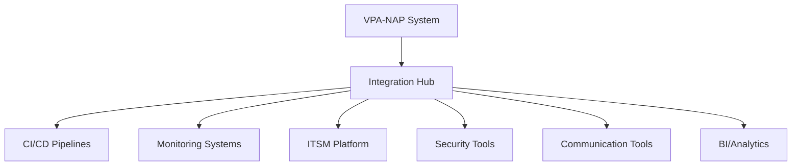

# Integration with Existing Tools

## Issue Summary
**Title:** Integrate VPA-NAP System with Existing DevOps and Management Tools

**Type:** Integration  
**Priority:** Medium  
**Labels:** `integration`, `toolchain`, `automation`, `vpa-nap`, `medium-priority`  
**Milestone:** Production Ready v1.1  
**Estimated Effort:** 36 hours  
**Assignee:** Platform Integration Team  

## Description
Integrate the VPA-NAP system with existing organizational tools including CI/CD pipelines, monitoring systems, ITSM platforms, and management dashboards to create a seamless operational experience and maintain consistency with established workflows.

## Background
Successful adoption of the VPA-NAP integration requires seamless integration with existing organizational toolchains. This includes CI/CD systems, monitoring platforms, ticketing systems, and management dashboards to ensure operational consistency and team productivity.

## Acceptance Criteria
- [ ] CI/CD pipeline integration for automated deployment
- [ ] ITSM platform integration for incident and change management
- [ ] APM tool integration for performance monitoring
- [ ] SIEM integration for security event correlation
- [ ] Configuration management tool integration
- [ ] Business intelligence dashboard integration
- [ ] Chat and collaboration tool integration (ChatOps)
- [ ] Asset management system integration
- [ ] Backup and recovery system integration
- [ ] Single sign-on (SSO) integration completed

## Definition of Done
- [ ] All critical tools integrated with documented APIs
- [ ] Data flow between systems validated and tested
- [ ] Authentication and authorization properly configured
- [ ] Monitoring and alerting across integrated tools functional
- [ ] User workflows streamlined across tool boundaries
- [ ] Team trained on integrated toolchain capabilities
- [ ] Integration monitoring and health checks implemented
- [ ] Rollback procedures for integration failures documented

## Technical Requirements
### Integration Architecture
- API-first approach for all integrations
- Event-driven architecture for real-time data flow
- Message queue system for reliable communication
- Authentication token management
- Rate limiting and error handling
- Data transformation and normalization

### Data Standards
- Consistent data formats across integrations
- Standardized event schemas
- Common identification and correlation IDs
- Unified timestamp and timezone handling
- Data encryption and security controls

## Testing Requirements
- [ ] End-to-end workflow testing across integrated tools
- [ ] API integration testing with mock services
- [ ] Authentication and authorization testing
- [ ] Error handling and recovery testing
- [ ] Performance impact assessment
- [ ] Data consistency validation

## Dependencies
- Issue #01: Production Deployment
- Issue #02: Monitoring and Alerting Setup
- Organizational tool inventory and API documentation
- Integration platform or middleware availability
- Security team approval for tool connections

## Risk Assessment
**Medium Risk Factors:**
- API compatibility issues with existing tools
- Authentication and security configuration complexity
- Data synchronization and consistency challenges
- Performance impact on existing systems
- Integration maintenance overhead

**Mitigation Strategies:**
- Comprehensive API testing and validation
- Phased rollout with monitoring
- Fallback mechanisms for integration failures
- Regular integration health monitoring
- Documentation and runbook maintenance

## Tasks Breakdown
1. **Integration Planning** (4h)
   - Tool inventory and API assessment
   - Integration architecture design
   - Data flow mapping
   - Security requirement analysis

2. **Core Integrations** (16h)
   - CI/CD pipeline integration
   - Monitoring system integration
   - ITSM platform integration
   - SSO and identity management

3. **Advanced Integrations** (10h)
   - ChatOps implementation
   - BI dashboard integration
   - SIEM correlation setup
   - Asset management integration

4. **Testing and Validation** (4h)
   - End-to-end workflow testing
   - Performance impact assessment
   - Security validation
   - User acceptance testing

5. **Documentation and Training** (2h)
   - Integration documentation
   - User workflow guides
   - Team training delivery
   - Troubleshooting runbooks

## Tool Integration Catalog

### CI/CD Pipeline Integration

#### Azure DevOps Integration
- **Purpose:** Automated deployment and release management
- **Integration Type:** REST API and webhooks
- **Data Exchange:** Deployment status, build artifacts, test results
- **Authentication:** Service principal with RBAC

**Implementation Details:**
- Build pipeline triggers for VPA-NAP updates
- Release pipeline with approval gates
- Test result integration and quality gates
- Deployment status updates to monitoring systems

#### GitLab CI/CD Integration
- **Purpose:** GitOps workflow automation
- **Integration Type:** GitLab API and webhook events
- **Data Exchange:** Commit information, pipeline status, deployment metrics
- **Authentication:** GitLab token with appropriate scopes

### Monitoring and Observability Integration

#### Prometheus/Grafana Integration
- **Purpose:** Metrics collection and visualization
- **Integration Type:** Prometheus exporters and Grafana datasources
- **Data Exchange:** Custom metrics, alerts, dashboard data
- **Authentication:** Token-based authentication

**Custom Metrics Exported:**
- `vpa_nap_integration_health`
- `vpa_recommendation_accuracy_rate`
- `nap_scaling_efficiency_score`
- `conflict_resolution_success_rate`

#### Datadog Integration
- **Purpose:** APM and infrastructure monitoring
- **Integration Type:** Datadog Agent and API
- **Data Exchange:** Traces, metrics, logs, events
- **Authentication:** API key and application key

### ITSM Platform Integration

#### ServiceNow Integration
- **Purpose:** Incident, change, and problem management
- **Integration Type:** ServiceNow REST API
- **Data Exchange:** Incident details, change requests, configuration items
- **Authentication:** OAuth 2.0 with refresh tokens

**Automated Workflows:**
- Incident creation for critical alerts
- Change request generation for deployments
- Configuration item updates for infrastructure changes
- Problem record linking for recurring issues

#### Jira Service Management Integration
- **Purpose:** Issue tracking and service requests
- **Integration Type:** Jira REST API and webhooks
- **Data Exchange:** Issue status, comments, attachments
- **Authentication:** API tokens with appropriate permissions

### Security and Compliance Integration

#### Splunk SIEM Integration
- **Purpose:** Security event correlation and analysis
- **Integration Type:** Splunk HTTP Event Collector
- **Data Exchange:** Security events, audit logs, compliance data
- **Authentication:** HEC token authentication

**Security Events Forwarded:**
- Authentication attempts and failures
- Authorization changes
- Configuration modifications
- Anomaly detection results

#### Azure Sentinel Integration
- **Purpose:** Cloud-native SIEM and SOAR
- **Integration Type:** Log Analytics workspace
- **Data Exchange:** Security alerts, incident data, investigation results
- **Authentication:** Managed identity or service principal

### Communication and Collaboration

#### Microsoft Teams Integration (ChatOps)
- **Purpose:** Real-time notifications and interactive operations
- **Integration Type:** Teams bot framework and webhooks
- **Data Exchange:** Alert notifications, command responses, status updates
- **Authentication:** Azure AD application registration

**ChatOps Commands:**
- `/vpa-nap status` - System health overview
- `/vpa-nap scale [tenant] [action]` - Scaling operations
- `/vpa-nap conflicts` - Current conflict status
- `/vpa-nap help` - Available commands

#### Slack Integration
- **Purpose:** Team communication and workflow automation
- **Integration Type:** Slack Web API and Events API
- **Data Exchange:** Channel messages, user interactions, workflow triggers
- **Authentication:** OAuth 2.0 with bot tokens

### Business Intelligence Integration

#### Power BI Integration
- **Purpose:** Executive reporting and business analytics
- **Integration Type:** Power BI REST API and data connectors
- **Data Exchange:** KPI metrics, cost data, utilization reports
- **Authentication:** Azure AD authentication

**Executive Dashboards:**
- Resource optimization ROI metrics
- Cost savings and efficiency trends
- System availability and performance
- Tenant satisfaction and adoption rates

#### Tableau Integration
- **Purpose:** Advanced analytics and data visualization
- **Integration Type:** Tableau Server API and data extracts
- **Data Exchange:** Historical data, trend analysis, predictive models
- **Authentication:** Personal access tokens

## Integration Patterns

### Event-Driven Integration
```json
{
  "event_type": "vpa_recommendation_generated",
  "timestamp": "2024-01-15T10:30:00Z",
  "tenant_id": "tenant-123",
  "resource_id": "pod-456",
  "recommendation": {
    "cpu": "500m",
    "memory": "1Gi"
  },
  "confidence_score": 0.95
}
```

### API-Based Integration
```python
# Example Python integration client
class VPANAPClient:
    def __init__(self, api_base_url, auth_token):
        self.base_url = api_base_url
        self.headers = {'Authorization': f'Bearer {auth_token}'}
    
    def get_tenant_metrics(self, tenant_id):
        response = requests.get(
            f"{self.base_url}/api/v1/tenants/{tenant_id}/metrics",
            headers=self.headers
        )
        return response.json()
```

### Webhook Integration
```yaml
apiVersion: v1
kind: ConfigMap
metadata:
  name: webhook-config
data:
  webhooks.yaml: |
    webhooks:
      - name: "servicenow-incident"
        url: "https://company.service-now.com/api/now/table/incident"
        events: ["alert.critical"]
        auth:
          type: "oauth2"
          config:
            client_id: "${SERVICENOW_CLIENT_ID}"
            client_secret: "${SERVICENOW_CLIENT_SECRET}"
```

## Data Flow Architecture

### Integration Hub Pattern


### Message Queue Integration
- **Technology:** Apache Kafka or Azure Service Bus
- **Purpose:** Reliable, scalable message delivery
- **Topics:** `vpa-events`, `nap-events`, `conflicts`, `alerts`
- **Consumers:** Various integrated tools and services

## Authentication and Security

### Identity and Access Management
- **SSO Integration:** Azure AD, Okta, or SAML-based IdP
- **API Authentication:** OAuth 2.0, JWT tokens, API keys
- **Service-to-Service:** Managed identities, service principals
- **Token Management:** Automatic rotation and renewal

### Security Controls
- **Network Security:** VPN, private endpoints, firewall rules
- **Data Encryption:** TLS 1.3 for transit, AES-256 for rest
- **Access Controls:** Principle of least privilege
- **Audit Logging:** Comprehensive integration activity logging

## Monitoring Integration Health

### Health Check Endpoints
```yaml
apiVersion: v1
kind: Service
metadata:
  name: integration-health
spec:
  selector:
    app: vpa-nap-integrations
  ports:
  - name: health
    port: 8080
    targetPort: health
```

### Integration Metrics
- `integration_api_response_time`
- `integration_success_rate`
- `integration_error_count`
- `webhook_delivery_success_rate`
- `authentication_failure_rate`

## Success Metrics

### Technical Metrics
- Integration uptime > 99.5%
- API response time < 500ms (p95)
- Data synchronization lag < 30 seconds
- Error rate < 1% for all integrations

### Business Metrics
- User productivity improvement > 20%
- Manual task reduction > 60%
- Tool switching frequency reduction > 40%
- User satisfaction with integrated workflows > 4.0/5

### Operational Metrics
- Mean time to resolution improvement > 30%
- Automated workflow adoption rate > 80%
- Integration maintenance overhead < 10% of total effort
- Cross-tool data consistency > 95%

## Maintenance and Evolution

### Regular Maintenance
- **Weekly:** Integration health monitoring review
- **Monthly:** API compatibility validation
- **Quarterly:** Security assessment and token rotation
- **Annually:** Tool landscape review and optimization

### Evolution Planning
- New tool evaluation and integration roadmap
- API version migration planning
- Integration architecture optimization
- Emerging technology adoption assessment

## Notes
- Prioritize integrations based on user workflow impact
- Maintain backward compatibility during tool upgrades
- Consider integration testing in CI/CD pipelines
- Plan for tool deprecation and replacement scenarios